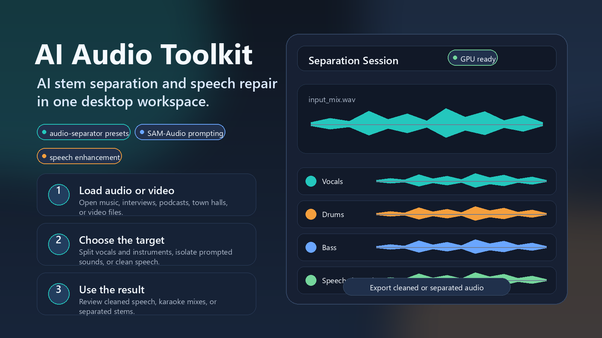
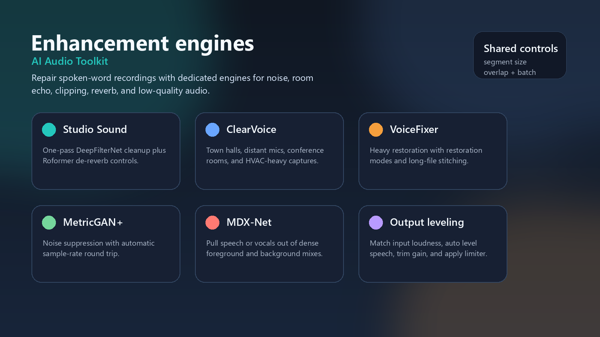
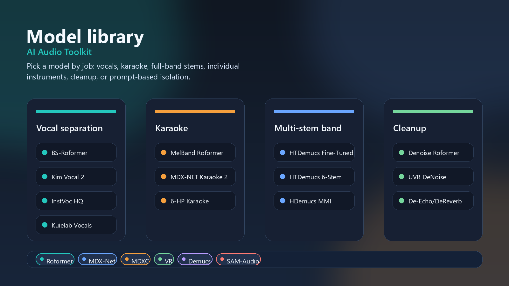

# AI Audio Toolkit



AI Audio Toolkit is a desktop app for separating audio sources and repairing speech. It brings together stem separation, prompt-based sound isolation, and speech enhancement so recordings can be cleaned, split, and reused.

The goal is to provide a UI for testing different audio separation and enhancement AI models, including SAM-Audio.

## Overview

| Enhancement engines | Model library |
| --- | --- |
|  |  |

## Use Cases

- Pull vocals, instrumentals, drums, bass, guitar, piano, and other stems from full mixes.
- Build karaoke tracks or extract individual instruments with model presets chosen for those jobs.
- Isolate a target sound from a text prompt with SAM-Audio, including TV variants for visual prompting.
- Clean difficult speech with dedicated engines for noise, room echo, clipping, reverb, and low-quality recordings.
- Chain practical cleanup stages such as DeepFilterNet noise removal plus Roformer de-reverb.
- Process audio from video files through FFmpeg extraction.

## Enhancement Engines

| Engine | Best For | Models / Modes | Main Controls |
| --- | --- | --- | --- |
| Resemble-Enhance | General speech or vocal restoration | Enhance, denoise only | ODE solver, function evaluations, enhancement strength, prior temperature, optional denoise-before-enhance |
| DeepFilterNet | Fast speech and vocal noise cleanup | DeepFilterNet | Attenuation limit, post-filter, automatic long-file chunking |
| Studio Sound | One-pass noise plus room cleanup | DeepFilterNet + De-Echo/DeReverb BS-Roformer | Noise stage, post-filter, reverb stage, Roformer segment size, overlap, batch size, pitch shift |
| ClearVoice | Town halls, distant mics, conference rooms, HVAC noise | `MossFormer2_SE_48K`, `FRCRN_SE_16K` | Model choice, optional Roformer de-reverb, de-reverb segment/overlap/batch/pitch |
| MDX-Net enhancement | Pulling speech or vocals out of noisy foreground/background mixes | Kim Vocal 2, Kuielab Vocals, UVR MDX-NET Inst HQ 4 | MDX segment size, overlap, batch size, denoise pass, optional Roformer de-reverb |
| VoiceFixer | Heavy speech restoration | Mode 0 full restoration, Mode 1 aggressive, Mode 2 no upsampling | Restoration mode, CUDA auto-detection, long-file stitching |
| MetricGAN+ | Noise suppression without de-reverb | `speechbrain/metricgan-plus-voicebank` | Fixed model, 16 kHz model path, original sample rate restored after processing |

Output leveling is shared across enhancement engines. The saved-file order is:

1. Match input loudness
2. Auto level active speech and trim peak
3. Output gain
4. Safety limiter

That means Match input loudness and Auto level stack. Match gets the processed file near the source first; Auto level can still move it toward a more consistent spoken-word level afterward. Output gain is the final trim.

## Separation Models

The standard separation tab uses `audio-separator` presets grouped by job.

| Category | Models |
| --- | --- |
| Vocal Separation | BS-Roformer (Best Quality), Kim Vocal 2, InstVoc HQ (MDX23C), UVR MDX-NET Inst HQ 4, Kuielab Vocals, 4-HP Vocal UVR |
| Karaoke | MelBand Roformer Karaoke (Best), UVR MDX-NET Karaoke 2, 6-HP Karaoke UVR |
| Multi-Stem Full Band | HTDemucs Fine-Tuned (4 stems), HTDemucs 6-Stem, HTDemucs Standard, HDemucs MMI |
| Individual Instruments | Kuielab Bass, Kuielab Drums, Kuielab Other |
| Audio Cleanup | Denoise MelBand Roformer (Best), UVR DeNoise, De-Echo/DeReverb, UVR DeEcho-DeReverb |

Supported architecture families:

- Roformer
- MDX-Net
- MDXC
- VR
- Demucs

Architecture-specific controls are exposed in the UI. Depending on the model, you can tune segment size, overlap, batch size, shifts, window size, aggression, pitch shift, TTA, high-end processing, post-processing, denoise pass, and segmented processing.

## SAM-Audio

SAM-Audio is for prompt-based isolation: type something like `isolate the drums`, `extract the piano`, or `separate the speaker`, then run separation against that target.

| App Option | Hugging Face Repo |
| --- | --- |
| SAM-Audio Small | `mrfakename/sam-audio-small` |
| SAM-Audio Base | `mrfakename/sam-audio-base` |
| SAM-Audio Large | `mrfakename/sam-audio-large` |
| SAM-Audio Small TV | `mrfakename/sam-audio-small-tv` |
| SAM-Audio Large TV | `mrfakename/sam-audio-large-tv` |

TV variants are meant for visual prompting. The app can load a video, let you select an object in a frame, and use that visual cue with the text prompt and candidate re-ranking.

SAM-Audio can use a large ImageBind checkpoint internally for visual ranking. The app treats model files and checkpoints as downloaded runtime data, not repository files.

## Requirements

- Python 3.10, 3.11, or 3.12
- Windows is the main target for the bundled app flow
- FFmpeg for video audio extraction
- NVIDIA GPU recommended for the heavier models
- CPU mode is possible for some workflows, but large models will be slow

## Quick Start

Clone the repository, create a virtual environment, install the base runtime, and launch the app:

```bash
git clone https://github.com/ababilinski/ai-audio-toolkit.git
cd ai-audio-toolkit
python -m venv .venv
.\.venv\Scripts\activate
python -m pip install --upgrade pip setuptools wheel
pip install -r requirements.txt
python run.py
```

For NVIDIA/CUDA systems, install the matching PyTorch build before `requirements.txt`. Example:

```bash
pip install torch torchaudio torchvision --index-url https://download.pytorch.org/whl/cu126
pip install -r requirements.txt --extra-index-url https://download.pytorch.org/whl/cu126
python run.py
```

To enable every enhancement engine shown in the UI:

```bash
pip install deepfilternet
pip install voicefixer speechbrain
pip install git+https://github.com/facebookresearch/sam-audio.git
pip install celluloid omegaconf pandas ptflops rich resampy tabulate gdown opencv-python python_speech_features scenedetect torchinfo yamlargparse
pip install resemble-enhance --no-deps
pip install clearvoice --no-deps
```

Model weights are not stored in the repository. They download on first use into the app-managed model/cache folders.

## Install From Source

Using `uv`:

```bash
uv venv .venv
.\.venv\Scripts\activate
uv pip install -r requirements.txt
python run.py
```

Or run the setup helper:

```bash
python setup_env.py
python run.py
```

For CPU-only `audio-separator` installs:

```bash
uv pip install -r requirements-cpu.txt
```

For CUDA builds, install the PyTorch wheel that matches your system. Example:

```bash
uv pip install torch torchaudio --extra-index-url https://download.pytorch.org/whl/cu124
```

## Optional Engine Packages

The base requirements install the app and the core `audio-separator` workflows. Some enhancement engines are optional because they are large, pull in heavier ML stacks, or can change shared packages such as Torch, torchaudio, and numpy.

The enhancement dropdown still shows every engine. If an optional package is missing, the app shows an install message when you select or run that engine instead of hiding the option.

| Engine | Package status |
| --- | --- |
| MDX-Net enhancement | Included through `audio-separator` |
| DeepFilterNet | Install manually with `pip install deepfilternet` |
| Resemble-Enhance | Install manually with `pip install resemble-enhance --no-deps` |
| ClearVoice | Install manually with `pip install clearvoice --no-deps` |
| VoiceFixer | Can install from inside the app when first used |
| MetricGAN+ | Can install from inside the app when first used |

```bash
pip install deepfilternet
pip install resemble-enhance --no-deps
pip install clearvoice --no-deps
```

The `--no-deps` installs are intentional. They keep those packages from replacing the app's already-selected ML runtime dependencies.

## Model Downloads And Storage

Model weights are downloaded on first use and are intentionally not committed to the repository. The Settings dialog lets you manage:

- Separator model directory
- Hugging Face cache
- DeepFilterNet model/cache root
- FFmpeg override path
- Extra runtime/DLL search paths
- Downloaded model inventory and deletion
- GPU/CUDA diagnostics
- Default output folder behavior

## Video Files

The app can open common video containers, extract the audio with FFmpeg, and process the extracted audio like any other input. Supported workflows include enhancement, separation, and SAM-Audio visual prompting for TV models.

## Windows Bundle Build

The supported Windows release build is the bundled-runtime launcher flow:

```bash
.\.venv\Scripts\python.exe build_bundle.py
```

Output:

```text
build\windows_bundle\ai-audio-toolkit\ai-audio-toolkit.exe
```

The launcher starts a bundled CPython runtime instead of freezing the ML stack directly. That keeps PyTorch, ONNX Runtime, CUDA DLLs, and the model libraries closer to the environment they expect.

The downloadable GitHub Actions artifact is the full `ai-audio-toolkit` folder, not only the `.exe`. It is large because it includes the Python runtime, FFmpeg, CUDA-capable PyTorch packages, `audio-separator`, SAM-Audio, and the optional enhancement engines. Model weights are not bundled; they download on first use.

## Practical Notes

- Batch size usually affects speed and memory, not quality.
- For Roformer and MDXC de-reverb, overlap `8` is the default; `12-16` is useful when long files have audible boundary artifacts.
- For speech cleanup, denoise first and add de-reverb only when the recording has real room sound.
